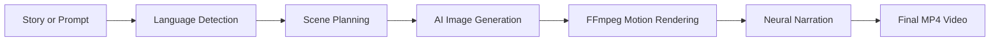
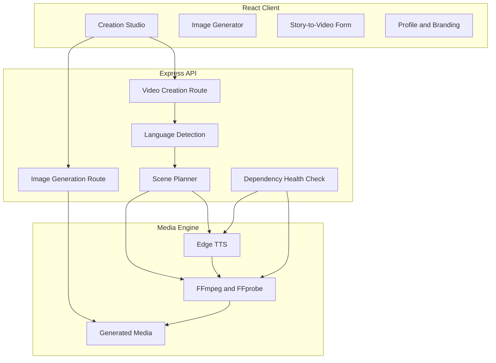

# VisionCraft AI

<p align="center">
  <strong>AI-powered image generation and story-to-video studio with Hindi, English and Hinglish neural narration.</strong>
</p>

<p align="center">
  <a href="https://github.com/Vishal619-dubey/VisionCraft-AI">
    <strong>Source Code</strong>
  </a>
</p>

<p align="center">
  
  
  
  
  
</p>

## Overview

VisionCraft AI is a full-stack creative media platform that converts text prompts into AI-generated images and transforms complete stories into vertical short videos. The application combines scene planning, image generation, motion effects, neural narration and FFmpeg-based video rendering in one workflow.

The project supports Hindi, English and Hinglish, automatically detects Hindi script, creates neural narration with Edge TTS and renders watermark-ready videos for portfolio, resume and social-media use.

## Why VisionCraft AI?

Most basic AI image tools stop after returning a single image. VisionCraft AI adds a complete content-production workflow:



- Generates AI images from custom prompts and styles.
- Converts stories into multiple visual scenes.
- Supports Hindi, English and Hinglish narration.
- Produces vertical MP4 videos with smooth motion and watermark support.
- Includes automatic retries, dependency checks and temporary-file cleanup.
- Uses a responsive, portfolio-ready React interface.

## Key Features

### AI Image Studio

- Prompt-based image generation.
- Multiple visual styles including cinematic, animated and photorealistic looks.
- Aspect ratios for square, landscape and vertical output.
- Professional preview workspace.

### Story-to-Video Generator

- Converts long-form stories into scene-based short videos.
- Supports video durations up to 120 seconds.
- Creates multiple scenes based on story length and duration.
- Applies zoom, pan, fade and cinematic motion effects.
- Exports standard MP4 video using FFmpeg.

### Neural Narration

- Hindi voice: `hi-IN-SwaraNeural`
- English voice: `en-IN-NeerjaNeural`
- Hinglish support with Hindi neural narration
- Automatic Hindi-script detection
- UTF-8 file-based TTS input
- Retry logic for temporary Edge TTS failures

### Professional Output

- Captions disabled for a clean visual result.
- Custom watermark support.
- Audio and video duration synchronization.
- Generated scene previews and final video URLs.
- Local generated-media storage.

### Portfolio-Ready Interface

- Custom VisionCraft AI branding.
- Modern dark SaaS-style layout.
- Editable profile photo stored in the browser.
- Responsive design.
- Clean image and video creation workflow.

## Technology Stack

| Layer | Technologies |
|---|---|
| Frontend | React, Vite, JavaScript, responsive CSS |
| Backend | Node.js, Express.js, CORS |
| Image Generation | Configurable prompt-based image endpoint |
| Voice | Python, Edge TTS |
| Video Processing | FFmpeg, FFprobe |
| Storage | Local generated and temporary folders |
| Runtime | Node.js 18+ and Python 3 |

## System Architecture



## Project Structure

```text
VisionCraft-AI/
├── client/
│   ├── src/
│   │   ├── App.jsx
│   │   ├── main.jsx
│   │   └── styles.css
│   ├── index.html
│   ├── package.json
│   └── vite.config.js
├── server/
│   ├── generated/
│   ├── temp/
│   ├── server.js
│   ├── .env.example
│   └── package.json
├── .gitignore
├── package.json
└── README.md
```

## Local Installation

### Prerequisites

- Node.js 18 or newer
- npm
- Python 3
- FFmpeg and FFprobe available in system `PATH`
- Internet connection for image generation and Edge TTS

### 1. Clone the repository

```bash
git clone https://github.com/Vishal619-dubey/VisionCraft-AI.git
cd VisionCraft-AI
```

### 2. Install dependencies

```bash
npm run install:all
```

Or install separately:

```bash
cd server
npm install

cd ../client
npm install
```

### 3. Install Edge TTS

```powershell
py -m pip install --upgrade edge-tts
```

Verify:

```powershell
py -m edge_tts --list-voices
```

### 4. Verify FFmpeg

```powershell
ffmpeg -version
ffprobe -version
```

### 5. Configure environment variables

```powershell
cd server
Copy-Item .env.example .env
```

Example:

```env
PORT=5000
CLIENT_URL=http://localhost:5173
IMAGE_API_BASE=https://image.pollinations.ai/prompt
```

### 6. Run the project

From the project root:

```bash
npm run dev
```

Or use two terminals.

Backend:

```powershell
cd server
node server.js
```

Frontend:

```powershell
cd client
npm run dev
```

Open:

- Frontend: `http://localhost:5173`
- API health check: `http://localhost:5000/api/health`

## API Summary

| Method | Endpoint | Purpose |
|---|---|---|
| GET | `/api/health` | Check FFmpeg, FFprobe and Edge TTS readiness |
| POST | `/api/images/generate` | Generate an AI image URL from a prompt |
| POST | `/api/shorts/create` | Create a narrated story video |
| GET | `/generated/:file` | Access generated images and videos |

### Story-to-video request example

```json
{
  "topic": "एक प्रेरणादायक हिंदी कहानी...",
  "duration": 45,
  "watermark": "@VISHAL619",
  "style": "Cinematic",
  "language": "Hindi"
}
```

## Testing Checklist

```powershell
node --version
py --version
py -m edge_tts --list-voices
ffmpeg -version
ffprobe -version
```

Recommended manual flow:

1. Start backend and frontend.
2. Open the health endpoint.
3. Generate an AI image.
4. Create a 15-second Hindi test video.
5. Create a longer video with enough narration text.
6. Confirm that the MP4 contains audio.
7. Check generated media inside `server/generated`.

## Important Notes

- Real `.env` files are ignored by Git.
- Generated images, videos and temporary files are not committed.
- Long stories should use longer selected durations.
- Edge TTS is an online service and may occasionally require a retry.
- The image-generation provider is configurable through `IMAGE_API_BASE`.

## Resume Summary

> Built VisionCraft AI, a full-stack AI media-generation platform using React, Node.js, Edge TTS and FFmpeg. Implemented multilingual neural narration, automated scene planning, AI image generation, cinematic video rendering, audio synchronization, dependency health checks and a responsive portfolio-ready interface.

## Author

**Vishal Dubey**

- GitHub: [Vishal619-dubey](https://github.com/Vishal619-dubey)
- Project: [VisionCraft AI](https://github.com/Vishal619-dubey/VisionCraft-AI)

## License

This project is currently provided for educational, portfolio and demonstration purposes.