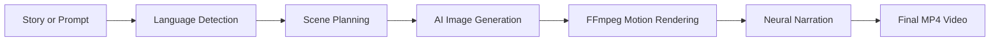
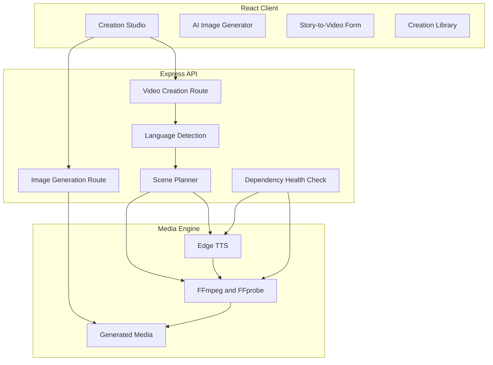

# VisionCraft AI

<p align="center">
  <strong>AI-powered image generation and story-to-video studio with Hindi, English and Hinglish neural narration.</strong>
</p>

<p align="center">
  <a href="https://visioncraft-ai-vishal.netlify.app">
    <strong>🚀 Open Live Demo</strong>
  </a>
  &nbsp;•&nbsp;
  <a href="https://visioncraft-ai-api-3g4r.onrender.com/api/health">
    API Status
  </a>
  &nbsp;•&nbsp;
  <a href="https://github.com/Vishal619-dubey/VisionCraft-AI">
    Source Code
  </a>
</p>

<p align="center">
  
  
  
  
  
  
</p>

## Overview

VisionCraft AI is a full-stack creative media platform that converts text prompts into AI-generated images and transforms complete stories into vertical short videos.

The application combines scene planning, image generation, cinematic motion effects, neural narration and FFmpeg-based video rendering in one workflow. It supports Hindi, English and Hinglish and automatically selects a suitable neural voice for narration.

## Live Project

| Service | URL |
|---|---|
| Live Frontend | [visioncraft-ai-vishal.netlify.app](https://visioncraft-ai-vishal.netlify.app) |
| Backend API | [visioncraft-ai-api-3g4r.onrender.com](https://visioncraft-ai-api-3g4r.onrender.com) |
| Health Check | [API Health Status](https://visioncraft-ai-api-3g4r.onrender.com/api/health) |
| Source Code | [GitHub Repository](https://github.com/Vishal619-dubey/VisionCraft-AI) |

> The backend uses a free Render instance. The first request after inactivity may take some time while the service wakes up.

## Why VisionCraft AI?

Most basic AI image tools stop after generating one image. VisionCraft AI provides a complete content-production workflow:



- Generates AI images from custom prompts.
- Converts stories into multiple visual scenes.
- Supports Hindi, English and Hinglish narration.
- Creates vertical MP4 videos with motion effects.
- Adds a custom watermark to generated videos.
- Provides downloadable images and videos.
- Includes dependency health checks for production deployment.

## Key Features

### AI Image Studio

- Prompt-based AI image generation.
- Multiple styles including Photorealistic, Cinematic, 3D Render, Anime, Digital Art and Minimal.
- Square, landscape and vertical aspect ratios.
- Regenerate, save and download actions.
- Recent creation gallery.

### Story-to-Video Studio

- Converts a complete story into a multi-scene video.
- Supports 15, 30, 45, 60, 90 and 120-second durations.
- Creates unique visuals for individual story scenes.
- Generates cinematic zoom, pan and fade effects.
- Produces downloadable MP4 videos.
- Displays a generated storyboard.

### Neural Narration

- Hindi voice: `hi-IN-SwaraNeural`
- English voice: `en-IN-NeerjaNeural`
- Hinglish support using Hindi neural narration
- Automatic Hindi-script detection
- Edge TTS retry handling
- Audio and video duration synchronization

### Portfolio-Ready Interface

- Modern dark SaaS-style design.
- Responsive desktop and mobile layout.
- Custom VisionCraft AI branding.
- Profile image support using browser storage.
- Creation history and favorites interface.
- Live frontend and backend deployment.


### Generated Storyboard and Video Preview


### Mobile Responsive View


## Technology Stack

| Layer | Technologies |
|---|---|
| Frontend | React, Vite, JavaScript, Lucide React, responsive CSS |
| Backend | Node.js, Express.js, CORS |
| Image Generation | Configurable prompt-based image endpoint |
| Voice Generation | Python, Edge TTS |
| Video Processing | FFmpeg, FFprobe |
| Deployment | Netlify, Render, Docker |
| Storage | Local generated and temporary media directories |
| Version Control | Git and GitHub |

## System Architecture



## Project Structure

```text
VisionCraft-AI/
├── client/
│   ├── src/
│   │   ├── App.jsx
│   │   ├── main.jsx
│   │   └── styles.css
│   ├── index.html
│   ├── package.json
│   └── vite.config.js
├── server/
│   ├── generated/
│   ├── temp/
│   ├── server.js
│   ├── .env.example
│   └── package.json
├── docs/
│   └── screenshots/
│       ├── image-studio.png
│       ├── story-video-studio.png
│       ├── generated-storyboard.png
│       └── mobile-view.png
├── .dockerignore
├── .gitignore
├── Dockerfile
├── package.json
└── README.md
```

## Local Installation

### Prerequisites

- Node.js 18 or newer
- npm
- Python 3
- FFmpeg and FFprobe available in the system `PATH`
- Internet connection for AI image generation and Edge TTS

### 1. Clone the repository

```bash
git clone https://github.com/Vishal619-dubey/VisionCraft-AI.git
cd VisionCraft-AI
```

### 2. Install project dependencies

```bash
npm run install:all
```

Or install separately:

```bash
cd server
npm install

cd ../client
npm install
```

### 3. Install Edge TTS

```powershell
py -m pip install --upgrade edge-tts
```

Verify:

```powershell
py -m edge_tts --list-voices
```

### 4. Verify FFmpeg

```powershell
ffmpeg -version
ffprobe -version
```

### 5. Configure environment variables

```powershell
cd server
Copy-Item .env.example .env
```

Example configuration:

```env
PORT=5000
CLIENT_URL=http://localhost:5173
IMAGE_API_BASE=https://image.pollinations.ai/prompt
```

### 6. Run the project

From the project root:

```bash
npm run dev
```

Or run both applications separately.

Backend:

```powershell
cd server
node server.js
```

Frontend:

```powershell
cd client
npm run dev
```

Open:

- Frontend: `http://localhost:5173`
- API health check: `http://localhost:5000/api/health`

## API Summary

| Method | Endpoint | Purpose |
|---|---|---|
| GET | `/api/health` | Check backend, FFmpeg, FFprobe and Edge TTS status |
| POST | `/api/images/generate` | Generate an AI image using a text prompt |
| POST | `/api/shorts/create` | Create a narrated story video |
| GET | `/generated/:file` | Access generated image and video files |

### Story-to-video request example

```json
{
  "topic": "एक प्रेरणादायक हिंदी कहानी...",
  "duration": 45,
  "watermark": "@VISHAL619",
  "style": "Cinematic",
  "language": "Hindi"
}
```

## Deployment

### Backend

The backend is deployed on Render using Docker.

The Docker image includes:

- Node.js
- Python
- Edge TTS
- FFmpeg
- FFprobe
- Required fonts

### Frontend

The React frontend is deployed on Netlify with:

```env
VITE_API_URL=https://visioncraft-ai-api-3g4r.onrender.com
```

The backend allows requests from:

```env
CLIENT_URL=https://visioncraft-ai-vishal.netlify.app
```

## Testing Checklist

```powershell
node --version
py --version
py -m edge_tts --list-voices
ffmpeg -version
ffprobe -version
```

Recommended manual flow:

1. Open the live frontend.
2. Generate an AI image.
3. Create a 15-second Hindi video.
4. Verify Hindi neural narration.
5. Test English and Hinglish narration.
6. Download the generated MP4.
7. Check mobile responsiveness.
8. Verify the backend health endpoint.

## Security and Repository Hygiene

- Real `.env` files are ignored by Git.
- Generated media and temporary files are not committed.
- Runtime dependencies are installed during Docker build.
- CORS is restricted using the deployed frontend URL.
- Environment variables are managed through Render and Netlify.

## Known Limitations

- The free Render backend may sleep after inactivity.
- Generated files use temporary server storage.
- Generated media may be removed after a redeploy or service restart.
- AI image and TTS generation require an internet connection.
- Long videos may take additional time to render.

## Future Improvements

- Persistent Cloudinary or object-storage integration.
- User authentication and personal workspaces.
- Database-backed generation history.
- Additional neural voices and languages.
- AI-generated background music.
- Video templates and transitions.
- Queue-based video rendering.
- Shareable public creation pages.

## Resume Summary

> Built and deployed VisionCraft AI, a full-stack AI media-generation platform using React, Node.js, Express, Python, Edge TTS, FFmpeg and Docker. Implemented multilingual neural narration, automated scene planning, prompt-based AI image generation, cinematic video rendering, watermarking, MP4 export, production health checks and responsive UI. Deployed the frontend on Netlify and the Dockerized backend on Render.

## Author

**Vishal Dubey**

- GitHub: [Vishal619-dubey](https://github.com/Vishal619-dubey)
- Live Demo: [VisionCraft AI](https://visioncraft-ai-vishal.netlify.app)
- Repository: [VisionCraft-AI](https://github.com/Vishal619-dubey/VisionCraft-AI)

## License

This project is currently provided for educational, portfolio and demonstration purposes.